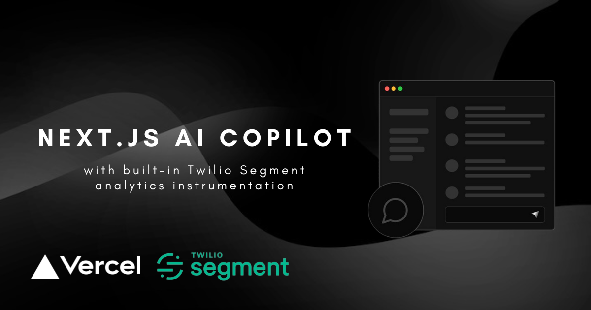

  
  <h1 align="center">Dinewith</h1>

<p align="center">
Dinewith is an AI-powered dining companion that helps you plan memorable gatherings. Chat with the assistant to design menus, capture guest preferences, and turn every conversation into a shareable dinner plan – all backed by a modern Next.js stack.
</p>

<p align="center">
  <a href="#features"><strong>Features</strong></a> ·
  <a href="#model-providers"><strong>Model Providers</strong></a> ·
  <a href="#deploy-your-own"><strong>Deploy Your Own</strong></a> ·
  <a href="#running-locally"><strong>Running locally</strong></a> ·
  <a href="#acknowledgements"><strong>Acknowledgements</strong></a>
</p>
<br/>

## Features

- Conversational dinner planning experience built with the [Next.js](https://nextjs.org) App Router and React Server Components.
- Streaming responses powered by the [Vercel AI SDK](https://sdk.vercel.ai/docs) so the assistant feels responsive while generating menu ideas or guest updates.
- Secure authentication using NextAuth with hashed credentials stored in [Vercel Postgres](https://vercel.com/docs/storage/vercel-postgres).
- Persistent chat history in [Vercel KV](https://vercel.com/storage/kv) with quick actions to share or revisit previous plans.
- Optional product analytics via [Segment](https://segment.com/) to understand how hosts collaborate with the assistant.

## Model Providers
Dinewith ships with OpenAI `gpt-3.5-turbo` as the default model. Thanks to the [Vercel AI SDK](https://sdk.vercel.ai/docs), it is straightforward to swap in providers such as [Anthropic](https://anthropic.com), [Cohere](https://cohere.com/), [Hugging Face](https://huggingface.co), or [LangChain](https://js.langchain.com) with only a few configuration changes.

## Deploy Your Own

Deploying to [Vercel](https://vercel.com) is the quickest way to get Dinewith in front of hosts. Create a new Vercel project, select this repository, and supply the environment variables listed below. The default Next.js build and output settings work seamlessly on Vercel.

## Environment setup

### Creating a KV Database Instance
Follow the steps outlined in the [Vercel KV quick start guide](https://vercel.com/docs/storage/vercel-kv/quickstart#create-a-kv-database). Once provisioned, update your environment variables (`KV_URL`, `KV_REST_API_URL`, `KV_REST_API_TOKEN`, `KV_REST_API_READ_ONLY_TOKEN`) with the credentials supplied by Vercel so chat sessions can be stored and retrieved.

### Creating a Postgres Database Instance
Similarly, follow the steps in the [Vercel Postgres quick start guide](https://vercel.com/docs/storage/vercel-postgres/quickstart) to provision a database for authentication. Update your environment variables (`POSTGRES_URL`, `POSTGRES_PRISMA_URL`, `POSTGRES_URL_NO_SSL`, `POSTGRES_URL_NON_POOLING`, `POSTGRES_USER`, `POSTGRES_HOST`, `POSTGRES_PASSWORD`, `POSTGRES_DATABASE`) so the signup and login flows can persist users securely.

### Configuring analytics (optional)
If you would like to capture anonymized usage insights, supply your [Segment](https://segment.com/) write key via `NEXT_PUBLIC_SEGMENT_WRITE_KEY`. In development, missing credentials simply disable tracking and log a helpful warning.

## Running locally

You will need the environment variables defined in [`example-env-vars`](./example-env-vars) to run Dinewith. It is recommended that you manage secrets through [Vercel Environment Variables](https://vercel.com/docs/projects/environment-variables), but a local `.env` file is sufficient for development.

> Note: You should not commit your `.env` file. Doing so would expose credentials that could compromise your OpenAI usage, analytics data, and authentication secrets.

1. Install Vercel CLI: `npm i -g vercel`
2. Link local instance with Vercel and GitHub accounts (creates `.vercel` directory): `vercel link`
3. Download your environment variables: `vercel env pull`

```bash
pnpm install
pnpm seed
pnpm dev
```

The application should now be running on [localhost:3000](http://localhost:3000/).

## Acknowledgements

Dinewith builds upon the open-source work of the Vercel and Next.js teams, along with the contributors to the original AI chatbot template and the shadcn/ui component library. We are grateful for their foundations.
